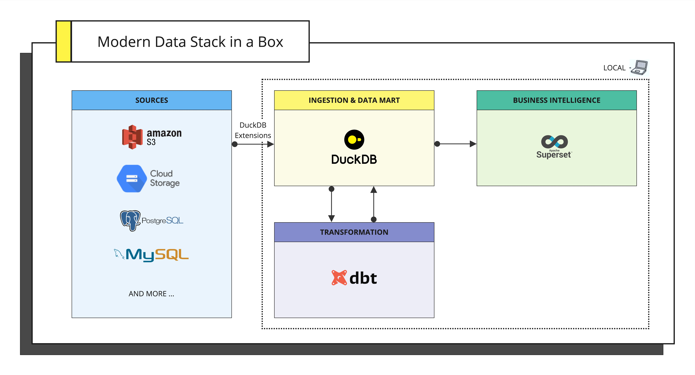
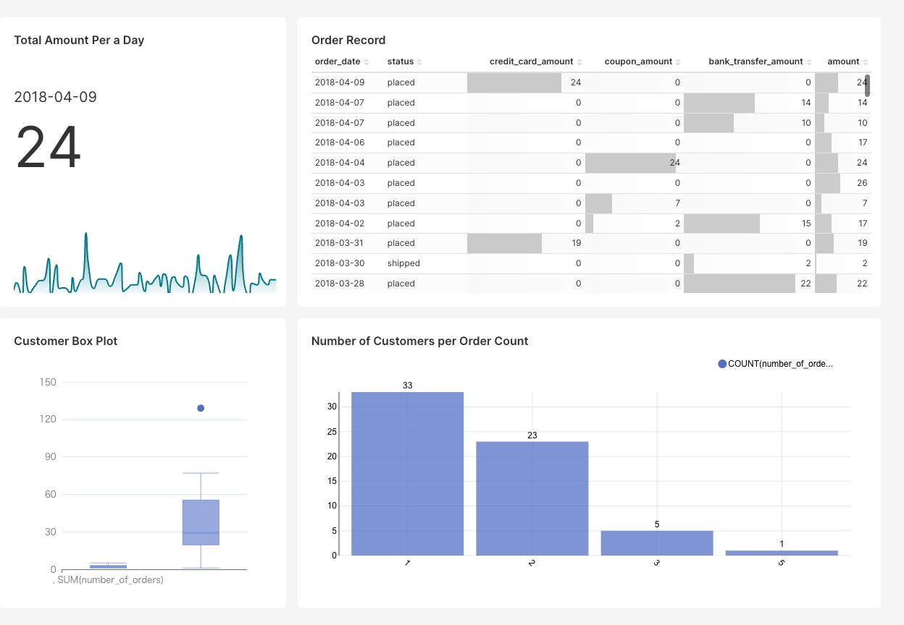
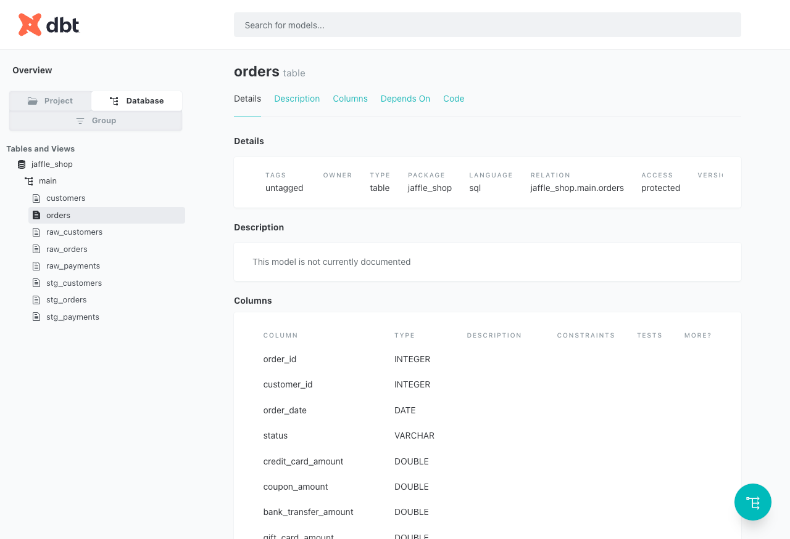
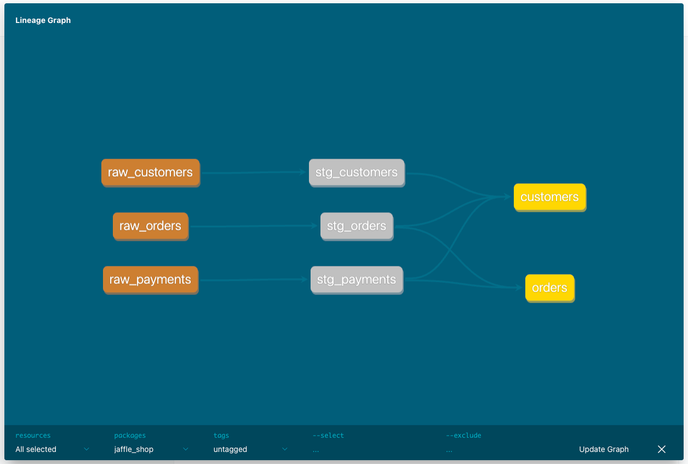

# jaffle_shop_duckdb_superset
---

This is a simple project using [dbt-duckdb](https://github.com/duckdb/dbt-duckdb) and [Apache Superset](https://superset.apache.org/) to build an all-in-one Modern Data Stack which can be used on your laptop without Cloud Stacks.

It's inspired by this article: [Modern Data Stack in a Box with DuckDB](https://duckdb.org/2022/10/12/modern-data-stack-in-a-box.html).
The specific configuration for implementation is as follows.
This time, the focus is on simplification, and parts such as `ORCHESTRATION` and `INGESTION` are omitted.
Considering the developer productivity in a local environment, `ORCHESTRATION` is unnecessary,
and for `INGESTION`, DuckDB's httpfs or scanner extension is considered sufficient.
Of course, it is possible to expand as necessary.



# Requirements

- [Docker](https://docs.docker.com/engine/install/)
- [Docker Compose](https://docs.docker.com/compose/install/)

# Setup

Just 2 steps!

1. Rename `.env.example` file to `.env` and set your desired password. Remember to never commit files containing passwords or any other sensitive information.
2. With **Docker engine** and **Docker-Compose** installed, change directory to the root folder of the project (also the one that contains docker-compose.yml) and run.o

    ```bash
    docker-compose up --build
    ```
   
# Screenshots

### Apache Superset



### dbt




# References

- [dbt-labs/jaffle_shop_duckdb](https://github.com/dbt-labs/jaffle_shop_duckdb/)
 